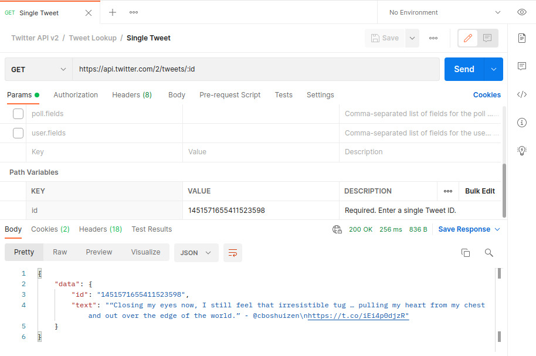

# NetworkAnalysis_Airbnb

In the following we will analyse the network created from
Airbnb, capturing the main measures and trying to understand some aspect, applying some community discovery
techniques and the simulation of diffusion model. In particular, we will implement, apart from the algorithms given in the
libraries, a new algorithm based on the spectral clustering.
Moreover, we would like to capture the so called "sockpuppet" phenomenon, that is all users that create more than one
account to deceive the restrictions given in the platform. All
the notebooks are stored in github repositories.

